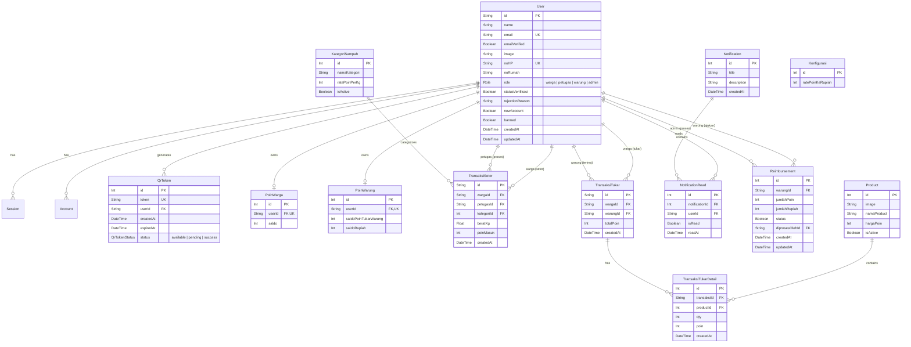

<div align="center">

# Hijau Desa

### Platform Digital untuk Mendukung Pengelolaan dan Pemberdayaan Desa

[!\[Live Demo](https://img.shields.io/badge/Live_Demo-Visit_Site-success?style=for-the-badge)](https://hijaudesa.site/)
[!\[GitHub](https://img.shields.io/badge/GitHub-Repository-181717?style=for-the-badge&logo=github)](https://github.com/RafyR27/Hijau-Desa)

**Submission for ITECHNO CUP 2026 - Web Development**

**By PecutAI**

</div>

## Akun Live Demo

| Email                           | Password             | Role                       |
| ------------------------------- | -------------------- | -------------------------- |
| warga1@gmail.com | warga1234 | Warga  |
| petugas1@gmail.com      | petugas1234 | Petugas |
| warung1@gmail.com            | warung1234    | Warung  |
| admin1@gmail.com            | admin1234    | Admin  |

\---

## Daftar Isi

- [Tentang Proyek](#tentang-proyek)
- [Fitur Unggulan](#fitur-unggulan)
- [Demo \& Screenshot](#demo--screenshot)
- [Teknologi](#teknologi)
- [Arsitektur Sistem](#arsitektur-sistem)
- [Instalasi \& Setup](#instalasi--setup)
- [Penggunaan](#penggunaan)
- [API Documentation](#api-documentation)
- [Testing & Quality Assurance](#testing--quality-assurance)
- [Tim Developer](#tim-developer)
- [Lisensi](#lisensi)

\---

## Tim Developer

| Nama                            | Peran                | GitHub                     |
| ------------------------------- | -------------------- | -------------------------- |
| **Mohammed Ali Irsyad Ginting** | Full Stack Developer | https://github.com/Sy4d-G  |
| **Muhamad Rafy Ramadhan**       | Full Stack Developer | https://github.com/RafyR27 |
| **Raihan Febriahdi**            | Backend Developer    | https://github.com/raifeb  |

\---

## Tentang Proyek

### Latar Belakang

Mengutip dari [GoodStats](https://goodstats.id/article/sampah-indonesia-didominasi-sisa-makanan-pada-2025-Yttj3), pada tahun 2025 total sampah nasional mencapai 25,14 juta ton. Angka ini dihimpun dari 244 kabupaten/kota yang telah melaporkan data ke Sistem Informasi Pengelolaan Sampah Nasional (SIPSN) milik Kementerian Lingkungan Hidup dan Kehutanan (KLHK). Dilihat dari sumbernya, penyumbang sampah terbesar masih diduduki oleh sampah rumah tangga sebesar 56,7%. Berdasarkan jenisnya, sisa makanan menjadi penyumbang sampah terbesar (40,76%), disusul oleh sampah plastik (20,49%).

Sampah rumah tangga di banyak desa dan pemukiman masih sering tercampur antara sampah organik dan non-organik. Berbagai seruan untuk memilah sampah selama ini cenderung diabaikan warga karena tidak memberikan manfaat langsung yang dirasakan, sehingga kebiasaan memilah sampah sulit terbentuk secara berkelanjutan.

Di sisi lain, program bank sampah konvensional yang sudah ada umumnya hanya menghubungkan dua pihak (penyetor dan pengelola bank sampah), sehingga manfaat ekonomi yang tercipta belum menjangkau pelaku usaha lokal seperti warung di sekitar wilayah tersebut.

### Solusi yang Ditawarkan

**Hijau Desa** hadir sebagai platform web yang menghubungkan **tiga pihak sekaligus** dalam satu ekosistem. Ketiganya terdiri dari warga sebagai rumah tangga penyetor sampah, petugas penimbangan yang membuka lapangan pekerjaan baru di lingkungan sekitar, dan warung mitra yang menerima penukaran poin sekaligus mendapatkan pelanggan baru dan penggantian dana. Seluruh proses dicatat secara digital melalui sistem poin berbasis QR code, sehingga transparan dan dapat diaudit oleh RT/RW atau Kepala Desa.

Warga yang menyetorkan sampah non-organik terpilah dikelompokkan ke dalam beberapa kategori seperti plastik & botol, kertas & kardus, serta logam & kaleng akan mendapatkan poin berdasarkan berat dan jenis sampahnya. Poin tersebut kemudian dapat ditukarkan dengan kebutuhan sehari-hari seperti gas, beras, minyak, dan galon air di warung mitra terdekat.

### Tujuan Proyek

- **Tujuan Utama:** Mendorong terbentuknya kebiasaan memilah sampah rumah tangga secara berkelanjutan melalui insentif poin yang nyata dan dapat ditukarkan langsung dengan kebutuhan sehari-hari.
- **Target Pengguna:** Warga desa/RT-RW/kompleks perumahan, petugas bank sampah setempat, pemilik warung/UMKM lokal, serta pengurus RT/RW atau Kepala desa sebagai admin pengelola program.
- **Value Proposition:** Berbeda dari platform bank sampah konvensional yang umumnya hanya menghubungkan dua pihak, Hijau Desa menghubungkan tiga pihak sekaligus (rumah tangga, penyedia jasa lokal, dan warung setempat) dalam satu ekosistem, sekaligus membuka peluang kerja baru melalui posisi petugas penimbangan.

\---

## Fitur Unggulan

### Fitur Utama

| Fitur                             | Deskripsi                                                                                                                                      | Keunggulan                                                                                                                                               |
| --------------------------------- | ---------------------------------------------------------------------------------------------------------------------------------------------- | -------------------------------------------------------------------------------------------------------------------------------------------------------- |
| **Setor Sampah via QR**           | Warga menampilkan QR code dinamis (token sementara, sekali pakai) untuk dipindai petugas saat menyetor sampah terpilah.                        | Token QR selalu diperbarui dan kedaluwarsa singkat, mencegah penyalahgunaan dari tangkapan layar lama.                                                   |
| **Sistem Poin Berbasis Kategori** | Poin dihitung otomatis dari berat sampah dikali rate poin sesuai kategori (Plastik & Botol, Kertas & Kardus, Logam & Kaleng).                  | Insentif proporsional terhadap nilai riil tiap jenis sampah, sekaligus mendorong kebiasaan memilah, bukan sekadar mencampur sampah.                      |
| **Tukar Poin ke Warung Mitra**    | Warga menukarkan poin ke barang kebutuhan sehari-hari (gas, beras, minyak, galon air) langsung di warung mitra terdekat melalui pemindaian QR. | Tidak memerlukan transaksi tunai antar warga dan warung; seluruh proses tercatat digital dan transparan.                                                 |
| **Dashboard & Audit Admin**       | Admin (RT/RW) dapat memantau seluruh transaksi setor dan tukar, mengelola kategori sampah, katalog barang, serta rate konversi poin ke Rupiah. | Memberikan transparansi dan akuntabilitas program tanpa menghambat kecepatan transaksi di lapangan (petugas dapat memproses transaksi secara real-time). |

### Fitur Tambahan

- **Verifikasi Akun Berjenjang** - Warga mendaftar mandiri (self-registration), kemudian diverifikasi oleh admin sebelum dapat mengakses fitur inti aplikasi.
- **Reimbursement Warung** - Sistem mencatat akumulasi saldo Rupiah yang perlu dicairkan admin ke warung mitra berdasarkan transaksi penukaran poin yang telah terjadi.
- **Notifikasi** - Warga, warung, dan petugas menerima notifikasi terkait update barang terbaru atau perubahan pada barang tertentu dan konversi poin ke rupiah jika terjadi perubahan.

\---

## Demo \& Screenshot

### Live Demo

[**Kunjungi Website**](https://hijaudesa.site/)

### Screenshot Aplikasi

<div align="center">


<p><em>Landing Page - Hijau Desa</em></p>


<p><em>Login Page</em></p>

#### Warga


<p><em>Dashboard Warga</em></p>


<p><em>QR Code Warga</em></p>

#### Warung


<p><em>Dashboard Warung</em></p>


<p><em>Scan QR Warung</em></p>


<p><em>Penukaran Poin Warga ke Warung</em></p>

#### Petugas


<p><em>Dashboard Petugas</em></p>


<p><em>Scan QR Petugas</em></p>


<p><em>Penyetoran Sampah Warga Oleh Petugas</em></p>

#### General (Warga, Warung, & Petugas)


<p><em>Riwayat (warga, warung, & petugas)</em></p>


<p><em>Katalog (warga, warung, & petugas)</em></p>


<p><em>Profile (warga, warung, & petugas)</em></p>

#### Admin


<p><em>Dashboard Admin</em></p>


<p><em>Verifikasi Warga oleh Admin</em></p>


<p><em>User management</em></p>


<p><em>Kategori Sampah</em></p>


<p><em>Katalog Produk</em></p>


<p><em>Riwayat Transaksi</em></p>


<p><em>Pencairan Dana</em></p>


<p><em>Pengaturan konversi poin ke rupiah</em></p>

</div>

### Video Demo

[Video Demo](https://drive.google.com/drive/folders/1rEgNtDjcc7c5NZybiKaku9-hb6kl0aW1)


## Teknologi

Aplikasi **Hijau Desa** dibangun menggunakan modern web stack berbasis **Next.js 16 App Router**, **TypeScript**, dan **Prisma ORM 7** dengan integrasi ekosistem cloud untuk autentikasi, database PostgreSQL, media storage, caching/rate limiting, serta transactional email.

### Tech Stack

#### Frontend

- **Framework:** [Next.js 16](https://nextjs.org/)
- **Language:** [TypeScript 5](https://www.typescriptlang.org/)
- **Styling & UI Kit:**
  - [Tailwind CSS v4](https://tailwindcss.com/) & [PostCSS](https://postcss.org/)
  - [Shadcn UI](https://ui.shadcn.com/) & [@base-ui/react](https://base-ui.com/)
  - [Lucide React](https://lucide.dev/) & [Hugeicons React](https://hugeicons.com/)
  - [tw-animate-css](https://www.npmjs.com/package/tw-animate-css)
- **State & Data Fetching:** [@tanstack/react-query v5](https://tanstack.com/query/latest) & [Axios](https://axios-http.com/)
- **Data Table:** [@tanstack/react-table](https://tanstack.com/table/latest)
- **Form & Validation:** [React Hook Form](https://react-hook-form.com/) & [Zod](https://zod.dev/) (`@hookform/resolvers`)
- **QR Code Engine:** [html5-qrcode](https://github.com/mebjas/html5-qrcode) (Scanner kamera) & [qrcode](https://www.npmjs.com/package/qrcode) (Generator QR dinamis)
- **User Experience & Feedback:**
  - [Driver.js](https://driverjs.com/) (Interactive Guided Onboarding Tour)
  - [Sonner](https://sonner.emilkowal.ski/) (Toast Notifications)
  - [Lottie React](https://lottiereact.com/) (Micro-animations)

#### Backend & Services

- **API Runtime:** Next.js Route Handlers (RESTful Architecture)
- **Database:** PostgreSQL (Cloud instance via Supabase)
- **ORM:** [Prisma ORM v7](https://www.prisma.io/) (dengan `@prisma/adapter-pg` & `pg` connection pool)
- **Authentication & Authorization:** [Better Auth v1](https://www.better-auth.com/) (Email & Password, Google OAuth, Session Management, Admin Plugin)
- **Rate Limiting & Caching:** [Upstash Redis](https://upstash.com/) (`@upstash/ratelimit` & `@upstash/redis`)
- **Email Service:** [Resend](https://resend.com/) & [React Email](https://react.email/) (Email reset password & notifikasi)
- **Media / Image Storage:** [Cloudinary](https://cloudinary.com/) (Unggah foto produk katalog)

#### Deployment & Tools

- **Deployment Platform:** [Vercel](https://vercel.com/)
- **Version Control:** Git & GitHub
- **Linter & Code Quality:** ESLint 9 (`eslint-config-next`)

### Alasan Pemilihan Teknologi

| Teknologi                         | Alasan Pemilihan                                                                                                                                                                                   |
| --------------------------------- | -------------------------------------------------------------------------------------------------------------------------------------------------------------------------------------------------- |
| **Next.js 16 (App Router)**       | Memungkinkan arsitektur full-stack terpadu dalam satu codebase, mengoptimalkan SEO di sisi landing page via SSR, serta menyajikan API Routes dengan serverless deployment.                         |
| **TypeScript**                    | Memastikan _type-safety_ end-to-end dari skema database Prisma hingga komponen frontend, meminimalkan bug saat runtime dan mempermudah kolaborasi tim.                                             |
| **Prisma ORM 7 + PostgreSQL**     | Memberikan abstraksi database yang kuat dengan query builder yang deklaratif, migrasi skema terstruktur, dan dukungan driver adapter modern (`@prisma/adapter-pg`) untuk performa pooling optimal. |
| **Better Auth**                   | Solusi autentikasi modern yang fleksibel, aman, terintegrasi langsung dengan Prisma adapter, serta mendukung _role-based access control_ (Warga, Petugas, Warung, Admin) dan Google Social Login.  |
| **Upstash Redis (Rate Limiting)** | Mencegah penyalahgunaan API (brute force login, token QR spam, dan abuse transaksi) dengan latensi ultra-rendah berbasis Redis di edge server.                                                     |
| **Cloudinary**                    | Menghandle manajemen file gambar katalog produk secara terpusat dengan optimasi format otomatis (WebP/AVIF) dan CDN global.                                                                        |
| **Resend & React Email**          | Memungkinkan pembuatan template email reset password berbasis React yang responsif dan pengiriman transaksional yang andal tanpa konfigurasi SMTP rumit.                                           |

---

## Arsitektur Sistem

### System Architecture

```text
               +-------------------------------------------------------------+
               |                       Klien / Pengguna                      |
               |         (Warga | Petugas Timbang | Warung Mitra | Admin)     |
               +------------------------------+------------------------------+
                                              |
                                              | HTTPS / Web Browser
                                              v
               +-------------------------------------------------------------+
               |                  Next.js 16 Web Application                 |
               |                                                             |
               |  +------------------------+     +------------------------+  |
               |  |  Frontend (React 19)   |     |   API Route Handlers   |  |
               |  |  - Landing Page        |     |  - /api/auth/*         |  |
               |  |  - Dashboard per Role  |<--->|  - /api/warga/*        |  |
               |  |  - QR Generator & Scan |     |  - /api/petugas/*      |  |
               |  |  - TanStack Query      |     |  - /api/warung/*       |  |
               |  +------------------------+     |  - /api/admin/*        |  |
               |                                 +-----------+------------+  |
               +---------------------------------------------|---------------+
                                                             |
                 +-------------------+-----------------------+-----------------------+
                 |                   |                       |                       |
                 v                   v                       v                       v
      +--------------------+ +---------------+      +-----------------+     +-----------------+
      |    Better Auth     | | Upstash Redis |      | Cloudinary CDN  |     |  Resend Email   |
      | (Session & Roles)  | | (Rate Limit)  |      | (Image Storage) |     | (Transactional) |
      +---------+----------+ +---------------+      +-----------------+     +-----------------+
                |
                v
      +--------------------+
      |  Prisma ORM 7 +    |
      |  @prisma/adapter-pg|
      +---------+----------+
                |
                v
      +--------------------+
      | PostgreSQL DB      |
      | (Supabase Hosted)  |
      +--------------------+
```

### Database Schema (Entity Relationship Diagram)



### Folder Structure

```text
Hijau-Desa/
├── app/                        # Next.js App Router (Halaman & Endpoint API)
│   ├── (auth)/                 # Route otentikasi (login, register, forgot-password)
│   ├── admin/                  # Dashboard & manajemen admin RT/RW
│   ├── api/                    # REST API route handlers
│   │   ├── admin/              # Endpoint modul admin (verifikasi, master data, reimbursement)
│   │   ├── auth/               # Endpoint Better Auth handler
│   │   ├── general/            # Endpoint publik/shared (profil, notifikasi, katalog)
│   │   ├── petugas/            # Endpoint penimbangan & verifikasi token setor
│   │   ├── warga/              # Endpoint token QR warga & dashboard
│   │   └── warung/             # Endpoint penukaran poin & pengajuan reimbursement
│   ├── complete-profile/       # Halaman kelengkapan nomor HP & rumah pasca registrasi
│   ├── petugas/                # Dashboard & fitur scanner penimbangan petugas
│   ├── rejected/               # Tampilan akun pendaftaran yang ditolak admin
│   ├── suspended/              # Tampilan akun yang dinonaktifkan/suspend
│   ├── warga/                  # Dashboard, QR generator, & katalog tukar warga
│   ├── warung/                 # Dashboard, scanner transaksi, & reimbursement warung
│   ├── globals.css             # Konfigurasi Tailwind CSS v4 & theme variables
│   └── layout.tsx              # Root layout & providers wrapper
├── components/                 # Reusable UI & Business Components
│   ├── admin/                  # Komponen khusus panel admin
│   ├── commons/                # Komponen bersama (Navbar, Sidebar, Modals, Status Screens)
│   ├── landing/                # Komponen landing page (Hero, Features, Stats, CTA)
│   ├── petugas/                # Komponen panel petugas
│   ├── ui/                     # Shadcn UI primitives (Button, Dialog, Table, Form, dll.)
│   ├── warga/                  # Komponen panel warga
│   └── warung/                 # Komponen panel warung
├── config/                     # File konfigurasi aplikasi & environment variables
├── hooks/                      # Custom React hooks
├── lib/                        # Utilitas inti & service connectors
│   ├── auth.ts                 # Konfigurasi Better Auth & plugins
│   ├── auth-client.ts          # Better Auth client instance
│   ├── cloudinary.ts           # Helper integrasi unggah Cloudinary
│   ├── db.ts                   # Inisialisasi Prisma Client & pooling connection
│   ├── qr.ts                   # Helper enkripsi & pembuatan token QR
│   ├── rate-limit.ts           # Middleware Upstash Redis rate limiter
│   └── redis.ts                # Inisialisasi koneksi Upstash Redis
├── prisma/                     # Konfigurasi database & skema Prisma
│   └── schema.prisma           # Skema model database & relasi
├── providers/                  # Context providers (React Query, ThemeProvider, Session)
├── public/                     # Static assets (gambar, ilustrasi Lottie, ikon)
├── types/                      # TypeScript type definitions & interfaces
├── next.config.ts              # Konfigurasi Next.js
├── package.json                # Dependencies & script run
├── prisma.config.ts            # Konfigurasi Prisma CLI & connection
├── tsconfig.json               # Konfigurasi compiler TypeScript
└── proxy.ts                    # Reverse proxy / utility helper
```

---

## Instalasi & Setup

### Prerequisites

Pastikan perangkat lokal telah terpasang:

- **Node.js:** Versi `>= 20.x` (LTS direkomendasikan)
- **npm:** Versi `>= 10.x`
- **Git:** Versi terbaru
- **PostgreSQL Database:** Database instance aktif (misal: Supabase, Neon, atau PostgreSQL lokal)

### Langkah Instalasi

#### 1. Clone Repository

```bash
git clone https://github.com/RafyR27/Hijau-Desa.git
cd Hijau-Desa
```

#### 2. Install Dependencies

```bash
npm install
```

#### 3. Setup Environment Variables

Salin template variabel lingkungan atau buat file `.env` di direktori root:

```env
# URL Basis Aplikasi
NEXT_PUBLIC_BASE_URL="http://localhost:3000"
BETTER_AUTH_URL="http://localhost:3000"
BETTER_AUTH_SECRET="your_better_auth_secret_key_min_32_characters"

# Database PostgreSQL (Supabase / Direct URL)
DATABASE_URL="postgresql://postgres:[PASSWORD]@[HOST]:5432/[DB_NAME]?sslmode=require"
DIRECT_URL="postgresql://postgres:[PASSWORD]@[HOST]:5432/[DB_NAME]?sslmode=require"

# Google OAuth Provider (Better Auth)
GOOGLE_CLIENT_ID="your-google-client-id.apps.googleusercontent.com"
GOOGLE_CLIENT_SECRET="your-google-client-secret"

# Resend Email Service (Transactional Emails)
RESEND_API_KEY="re_1234567890abcdef"

# Cloudinary Media Storage (Upload Foto Barang & Avatar)
CLOUDINARY_CLOUD_NAME="your_cloud_name"
CLOUDINARY_API_KEY="your_cloudinary_api_key"
CLOUDINARY_API_SECRET="your_cloudinary_api_secret"

# Upstash Redis (Rate Limiting & Caching)
UPSTASH_REDIS_REST_URL="https://your-upstash-instance.upstash.io"
UPSTASH_REDIS_REST_TOKEN="your_upstash_rest_token"
```

> [!IMPORTANT]
> Pastikan variabel database `DATABASE_URL` dan `DIRECT_URL` terhubung ke instance PostgreSQL yang valid sebelum menjalankan sinkronisasi Prisma.

#### 4. Setup Database & Prisma Client

Jalankan perintah berikut untuk menghasilkan Prisma Client lokal dan menyinkronkan skema database:

```bash
# Generate Prisma Client
npx prisma generate

# Sinkronisasikan skema model ke database PostgreSQL
npx prisma db push
```

_(Opsional)_ Buka Prisma Studio untuk meninjau data melalui browser GUI:

```bash
npx prisma studio
```

#### 5. Jalankan Server Pengembangan

```bash
npm run dev
```

Buka peramban dan akses:

```text
http://localhost:3000
```

---

## Penggunaan

### Command Scripts

| Perintah        | Fungsi                                                                             |
| --------------- | ---------------------------------------------------------------------------------- |
| `npm run dev`   | Menjalankan development server lokal pada `http://localhost:3000`.                 |
| `npm run build` | Menjalankan generator Prisma client dan melakukan build bundle production Next.js. |
| `npm run start` | Menjalankan server aplikasi Next.js mode production setelah proses build selesai.  |
| `npm run lint`  | Menjalankan pemeriksaan kode menggunakan ESLint 9.                                 |

### Panduan Alur Pengguna (User Guide)

#### 1. Untuk Warga

1. **Pendaftaran:** Daftar mandiri melalui form registrasi atau menggunakan akun Google.
2. **Lengkapi Profil:** Isi No. WhatsApp aktif dan Nomor Rumah untuk memudahkan identifikasi oleh pengurus.
3. **Menunggu Verifikasi:** Akun ditinjau oleh Admin. Setelah disetujui, akses seluruh dashboard terbuka.
4. **Setor Sampah:** Di pos penimbangan, buka menu **Setor Sampah** untuk men-generate Token QR dinamis, perlihatkan kepada petugas untuk dipindai, lalu poin otomatis bertambah ke saldo.
5. **Tukar Poin:** Kunjungi warung mitra, tunjukkan Token QR penukaran, pilih barang kebutuhan yang diinginkan, dan konfirmasi penukaran poin.

#### 2. Untuk Petugas Penimbangan

1. **Login Petugas:** Masuk menggunakan akun ber-role `petugas` yang telah didaftarkan admin.
2. **Scan QR Warga:** Gunakan kamera perangkat untuk memindai QR dinamis yang ditunjukkan oleh warga.
3. **Input Berat Sampah:** Pilih kategori sampah (Plastik, Logam, Kertas, dll.) dan masukkan berat timbangan (kg).
4. **Selesaikan Transaksi:** Sistem otomatis mengalkulasi total poin dan mengirimkannya ke akun warga secara instan.

#### 3. Untuk Warung Mitra

1. **Login Warung:** Masuk menggunakan akun ber-role `warung` yang dibuat oleh admin.
2. **Proses Penukaran:** Pindai QR warga, pilih produk kebutuhan harian (sembako, galon, gas, dll.) dari katalog yang diminta warga.
3. **Pencatatan Saldo:** Poin warga terpotong otomatis dan terakumulasi menjadi saldo Rupiah piutang di warung Anda.
4. **Klaim Reimbursement:** Ajukan klaim pencairan saldo Rupiah ke admin RT/RW secara berkala melalui tombol pengajuan reimbursement.

#### 4. Untuk Admin

1. **Verifikasi Warga:** Tinjau pendaftaran warga baru, setujui atau tolak dengan menyertakan alasan.
2. **Master Kategori Sampah:** Atur kategori sampah non-organik beserta rate poin per kilogramnya.
3. **Katalog Produk:** Tambahkan dan kelola barang kebutuhan yang tersedia di warung mitra (nama, foto, nilai poin).
4. **Konfigurasi Sistem:** Tentukan rate konversi poin ke Rupiah untuk perhitungan reimbursement warung.
5. **Proses Reimbursement:** Verifikasi dan setujui pencairan dana tunai kepada pemilik warung mitra yang mengajukan klaim.
6. **Audit & Log:** Pantau log transaksi penimbangan, dan log penukaran sembako.

---

## API Documentation

Seluruh API route aplikasi berada di bawah direktori `app/api/` dan menerapkan proteksi session berbasis cookie via Better Auth serta rate limiting dari Upstash Redis.

### Base URL

```text
Development: http://localhost:3000/api
Production:  https://hijaudesa.site/api
```

### Ringkasan Endpoint Utama

#### 1. Autentikasi (`/api/auth/*`)

- Handled oleh Better Auth handler (`/api/auth/[...all]`) untuk login, register, OAuth callback, session check, logout, dan reset password.

#### 2. Modul Warga (`/api/warga`)

- `POST /api/warga/generate-qr` - Menghasilkan token QR dinamis (berlaku terbatas) untuk setor/tukar.
- `GET /api/warga/check-qr` - Memeriksa status token QR secara polling/realtime.
- `GET /api/warga/dashboard` - Mengambil statistik poin warga, riwayat setor, dan riwayat tukar terbaru.

#### 3. Modul Petugas (`/api/petugas`)

- `GET /api/petugas/kategori` - Mengambil daftar kategori sampah aktif dan rate poin/kg.
- `POST /api/petugas/timbang` - Memproses penimbangan sampah dari token QR warga.
- `GET /api/petugas/dashboard` - Mengambil statistik total berat timbangan dan riwayat aktivitas petugas.

#### 4. Modul Warung (`/api/warung`)

- `POST /api/warung/tukar` - Memproses penukaran poin warga dengan produk katalog warung.
- `GET /api/warung/dashboard` - Mengambil data saldo poin, saldo Rupiah, dan transaksi penukaran warung.
- `POST /api/warung/reimbursement` - Mengajukan klaim pencairan saldo Rupiah ke admin.

#### 5. Modul Admin (`/api/admin`)

- `GET / POST / PUT /api/admin/verif-warga` - Verifikasi, persetujuan, atau penolakan pendaftaran akun warga.
- `GET / POST / PUT / DELETE /api/admin/kategori` - Manajemen master data kategori sampah dan rate poin.
- `GET / POST / PUT / DELETE /api/admin/product` - Manajemen katalog produk penukaran warung.
- `GET / PUT /api/admin/konfigurasi` - Manajemen rate konversi poin ke Rupiah.
- `GET / PUT /api/admin/reimbursement` - Meninjau dan menyetujui reimbursement warung mitra.
- `POST /api/admin/upload` - Unggah gambar produk ke Cloudinary.
- `GET /api/admin/dashboard` - Agregat statistik keseluruhan ekosistem desa.

#### 6. Modul General & Profil (`/api/general`)

- `GET /api/general/katalog` - Mengambil katalog produk aktif untuk ditampilkan ke warga dan warung.
- `GET /api/general/notification` & `POST /api/general/notification` - Manajemen notifikasi broadcast dan penanda baca.
- `GET /api/general/riwayat` - Mengambil riwayat transaksi setor dan tukar terperinci.
- `POST /api/general/edit-profile` - Memperbarui data pengguna (nama, nomor HP, alamat rumah).

---

## Testing & Quality Assurance

### Linting & Static Code Analysis

Proyek menggunakan ESLint 9 dan TypeScript compiler untuk memastikan konsistensi kode dan kepatuhan terhadap tipe data:

```bash
# Menjalankan pengecekan linter ESLint
npm run lint

# Menjalankan static type check tanpa build
npx tsc --noEmit
```

### Checklist Verifikasi Fungsionalitas

- [x] **Autentikasi & Otorisasi:** Registrasi email, Google OAuth, verifikasi email, proteksi role middleware, dan reset password via Resend.
- [x] **Rate Limiting:** Pengujian proteksi brute force dan limit request API via Upstash Redis.
- [x] **Keamanan Token QR:** Token dibuat dengan _expiry time_ dan status sekali pakai (_one-time use_) untuk mencegah _replay attack_.
- [x] **Integritas Transaksi:** Deduplikasi saldo poin warga dan penambahan saldo warung berjalan secara atomic.
- [x] **Media Upload:** Validasi format dan ukuran upload foto produk ke Cloudinary.
- [x] **Responsivitas UI:** Tampilan responsif optimal diakses dari perangkat mobile (smartphone petugas/warga/warung) maupun desktop (panel admin RT/RW).

---

## Lisensi

Proyek ini dibuat dan didistribusikan di bawah lisensi **MIT License**. Lihat file [LICENSE](LICENSE) untuk informasi lisensi selengkapnya.

---

<div align="center">

**Made with ❤️ by PecutAI for ITECHNO CUP 2026**

</div>
